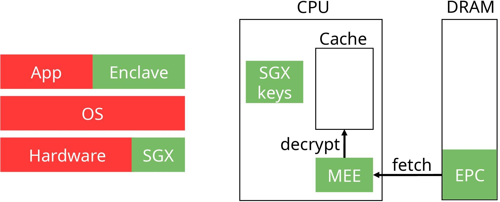
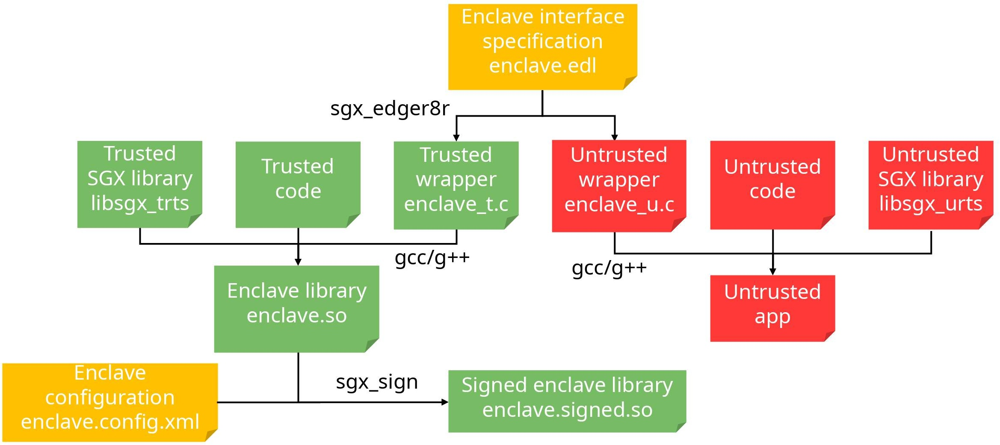
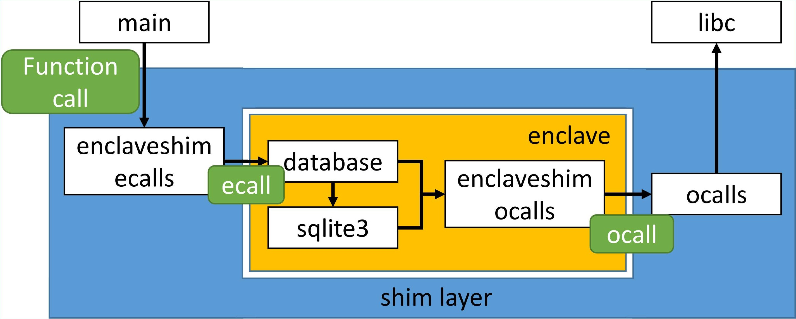

# Intel SGX tutorial

## Introduction

Cloud computing users send their code and data to the cloud provider,
effectively transferring control over a third party. This poses security
threats: data leakage, unauthorized modifications, etc. Even if the cloud
provider spends a considerable amount of time securing his infrastructure, a
simple bug could break havoc.

Faced with this challenge, several Trusted Execution Environments (TEEs) have
been proposed, such as Intel SGX, ARM TrustZone, AMD SEV or RISC-V Keystone.
These Trusted Execution Environments are a special execution mode of the main
processor that provides security guarantees (namely confidentiality and
integrity) over the code and data even in an untrusted environment where both
the software (including the OS and hypervisor) as well as the hardware
(excluding the CPU package) are untrusted.

Among these different TEEs, the most popular is Intel Software Guard Extensions
(SGX). Intel SGX offers /enclaves/ to the developer, which are isolated from
the rest of the system to handle sensitive data (see figure below). The enclave
memory is always encrypted when stored outside of the main CPU, in a special
region of DRAM called /Enclave Page Cache/ (EPC). The Intel Memory Encryption
Engine (MEE) is then in charge of transparent encryption/decryption upon data
movement. The EPC is shared between all the running enclaves, but each enclave
memory pages are isolated from other enclaves. This means that inter-enclaves
secure communication needs to be implemented by the developer.



Historically, the first versions of Intel SGX proposed a small EPC of at most a
hundreds of MBs. The most recent version of SGX, called Scalable SGX and
present on the 3rd generation of Intel Xeon Scalable processors, extends this
limit to hundreds of GBs, but at the cost of lack of integrity protection
against hardware attacks: an attacker could physically tamper with the memory
module or bus to revert (part of) the EPC to a previously valid state (see
[this
paper]((https://www.intel.com/content/dam/www/public/us/en/documents/white-papers/supporting-intel-sgx-on-mulit-socket-platforms.pdf)).

Intel SGX provides an attestation mechanism so that remote clients can verify
the enclave has been correctly initialised on a real SGX hardware. This
attestation mechanism relies on some cryptographic keys unique to each CPU and
a trusted third-party (see
[this
paper](https://community.intel.com/legacyfs/online/drupal_files/managed/57/0e/ww10-2016-sgx-provisioning-and-attestation-final.pdf)).

Intel SGX provides a set of assembly instructions to develop an enclave. For
ease of use, Intel has developed the [SGX
SDK](https://software.intel.com/en-us/sgx-sdk/) for C/C++ applications. The
idea when developing with Intel SGX is to execute only parts of our
application inside the enclave, in order to minimize the attack surface. Note
that some projects, such as SCONE or SGX-LKL, execute an entire application
inside the enclave, which have their own advantages and drawbacks. Please see
the "Further readings" section.

Entering and exiting the enclave is done via a precise interface composed of
/enclave calls/ (`ecalls`) and /outside calls/ (`ocalls`). This interface, in a
C-like language, also specifies how data is moved between inside and outside
the enclave (e.g., from the inside to the outside, etc.). We will present it in
more details below.

The [Rust programming language](https://www.rust-lang.org/) is designed with
performance and safety in mind. Its compiler prevents a wide range of runtime
errors such as buffer overflow, data races, etc. As these errors can lead to
severe security vulnerabilities, it is but natural that developers consider it
for building their secure applications. To this end they can leverage the
Apache Teaclave SGX or Fortanix EDP SDKs.

In this tutorial we will write simple SGX applications both in C/C++ and Rust,
leveraging the official Intel SGX and Apache Teaclave SDKs. We will use the
Intel SGX SDK version 2.17, which is the latest release at the time of writing
this tutorial. We consider you are running a recent version of Ubuntu (e.g.,
20.04 LTS). Having access to real SGX hardware is preferable but not mandatory:
the SDK also provides a software mode that emulates the enclave behaviour.

The source code of the examples can be found
[here](https://github.com/plaublin/intel_sgx_tutorial).

## Intel SGX SDK (C/C++)

The [Intel SGX SDK](https://software.intel.com/en-us/sgx-sdk/) provides
abstractions over the SGX assembly instructions. In particular, it provides:
	- a way to define the enclave interface, composed of /enclave calls/
	(`ecalls`) and /outside calls/ (`ocalls`);
	- a trusted subset of the C/C++ standard library;
	- a cryptographic library (secure hash, encryption, etc.);
	- some synchronization primitives;
	- random number generation;
	- etc.

A more detailed list of functionalities can be found in the
[Developer Reference](https://download.01.org/intel-sgx/sgx-linux/2.17/docs/Intel_SGX_Developer_Reference_Linux_2.17_Open_Source.pdf).

Enclave transitions (`ecalls` or `ocalls`) are a performance bottleneck and
should be avoided if possible. Techniques such as asynchronous calls
implemented in [TaLoS](https://github.com/lsds/TaLoS), or switchless calls
implemented in the SGX SDK (via the `transition_using_threads`; see Intel
documentation) can help to alleviate this problem.

### Installation

The installation is a multi-steps process. If your hardware supports Intel SGX,
you need to install the driver. This step is not necessary if your hardware
does not support Intel SGX and/or you will run the examples in simulation mode.
In all cases you need to follow the instructions to install a few extra packages
and the Intel SGX SDK.

This tutorial has been written and tested with the Intel SGX SDK version 2.17:
- [driver](https://download.01.org/intel-sgx/sgx-linux/2.17/distro/ubuntu20.04-server/sgx_linux_x64_driver_2.11.054c9c4c.bin)
- [sdk](https://download.01.org/intel-sgx/sgx-linux/2.17/distro/ubuntu20.04-server/sgx_linux_x64_sdk_2.17.100.3.bin)

For more information, please refer to the [official
documentation](https://download.01.org/intel-sgx/sgx-linux/2.17/docs/Intel_SGX_SW_Installation_Guide_for_Linux.pdf).

#### Intel SGX driver

There exists 3 versions: (i) in-kernel driver, included in Linux since v5.11;
(ii) DCAP driver; and (iii) out-of-tree driver. For production environments,
the in-kernel or DCAP driver is to be prefered. For debugging and ease of use,
as in this tutorial, we will use the out-of-tree driver.

The latest driver and documentation can be found
[here](https://download.01.org/intel-sgx/latest/linux-latest/). Please check
this link to find the correct driver for your distribution. For example, for
Ubuntu 20.04, the 3 driver versions are located
[here](https://download.01.org/intel-sgx/latest/linux-latest/distro/ubuntu20.04-server/).
The out-of-tree driver is the one with an hexadecimal chain in the name, e.g.,
`sgx_linux_x64_driver_2.11.054c9c4c.bin`.

Please follow these instructions to install the driver:
```bash
$ export SGX_DRIVER="sgx_linux_x64_driver_2.11.054c9c4c.bin" 
$ sudo apt install build-essential ocaml automake autoconf libtool wget python libssl-dev
$ wget https://download.01.org/intel-sgx/sgx-linux/2.17/distro/ubuntu20.04-server/$SGX_DRIVER
$ chmod +x $SGX_DRIVER
$ sudo ./$SGX_DRIVER
```
Once the installation is complete, a character device `/dev/isgx` should
appear and an uninstall script has been placed in `/opt/intel/sgxdriver`.


#### A few extra packages and aesmd service

The following steps are mandatory for both hardware and simulation modes.

We will add the Intel SGX SDK repository to our package manager and download
Intel SGX packages (the last line installs debug symbols packages).
```bash
$ echo 'deb [arch=amd64] https://download.01.org/intel-sgx/sgx_repo/ubuntu focal main' | sudo tee /etc/apt/sources.list.d/intel-sgx.list
$ wget -qO - https://download.01.org/intel-sgx/sgx_repo/ubuntu/intel-sgx-deb.key | sudo apt-key add
$ sudo apt update
$ sudo apt install libsgx-epid libsgx-quote-ex libsgx-aesm-launch-plugin
$ sudo apt install libsgx-urts-dbgsym libsgx-enclave-common-dbgsym
```

If you have SGX-capable hardware, the `aesmd` service should now be running:
```bash
$ sudo service aesmd status
● aesmd.service - Intel(R) Architectural Enclave Service Manager
Loaded: loaded (/lib/systemd/system/aesmd.service; enabled; vendor preset: enabled)
Active: active (running)
...
```

#### Intel SGX SDK

We need to download and install the SGX SDK. We will install it in the `/opt/intel/sgxsdk` directory:
```bash
$ export SGX_SDK=sgx_linux_x64_sdk_2.17.100.3.bin
$ wget https://download.01.org/intel-sgx/sgx-linux/2.17/distro/ubuntu20.04-server/$SGX_SDK
$ chmod +x $SGX_SDK
$ sudo ./$SGX_SDK --prefix /opt/intel
```

The SGX SDK is now installed in `/opt/intel/sgxsdk`. To set all environment
variables, in particular to get access to the debugger, run the following
command:
```bash
$ source /opt/intel/sgxsdk/environment
```

### Hello World!

As always, we start with a simple "Hello World!" application, located in the
`hello_world` directory in [this tutorial source
code](https://github.com/plaublin/intel_sgx_tutorial/) . It contains the
following files:
 - `main.c`: untrusted code, main entry point;
 - `enclave.c`: enclave code;
 - `enclave.edl`: contains the enclave interface (list of `ecalls` and `ocalls`);
 - `enclave.config.xml`: enclave configuration file. In particular it defines the
 maximal numbers of concurrent threads inside the enclave (`TCSNum`) and the
 heap maximal size in bytes (`HeapMaxSize`);
 - `enclave.lds`: necessary to create the enclave shared library;
 - `enclave_private_test.pem`: private key used to sign the enclave;
 - `Makefile`.

#### Compilation

The figure below details the SGX SDK compilation process. The `enclave.edl`
file, which describes the enclave interface, is used by the `sgx_edger8r` tool
to generate two set of files, `enclave_t.[ch]` and `enclave_u.[ch]`. These
files contain the `ecalls` and `ocalls` definition as C code. Both the
untrusted code and trusted code can then be compiled. The untrusted code
compilation generates a binary file while the trusted code compilation
generates the enclave library `enclave.so`. The `sgx_sign` tool finally reads
the enclave configuration file to sign the enclave library. The developer can
then ship the binary with the signed enclave to its users.



By default, the `Makefile` compiles the code in hardware mode. To
compile in simulation mode, for example if you do not have SGX-capable
hardware, prepend `SGX_MODE=SIM` to the call to `make`. Note that simulation
mode does not offer any protection to your code.

In summary,
- to compile in hardware mode: `make`;
- to compile in simulation mode: `SGX_MODE=SIM make`.

#### Execution

Executing the binary file produces the following result. If you need to debug
your application, please use `sgx-gdb` instead of `gdb`. Behaviours are
similar.
```bash
$ ./app
Hello World!
```

The following error can be encountered if you compile for hardware mode but do
not have SGX hardware:
```
$ ./app
Info: Please make sure SGX module is enabled in the BIOS, and install SGX driver afterwards.
Error: Invalid SGX device.
Cannot initialize the enclave...
```
To fix it: `make clean; SGX_MODE=SIM make`.

#### Enclave interface

The enclave interface of this example contains two functions:
`ecall_entrypoint()` and `ocall_printf([in, string] const char* str)`. While
not mandatory, it is good practice to prefix the `ecalls` and `ocalls` names
with `ecall` or `ocall` to clearly identify them.

`ecall_entrypoint()` is our entry-point to the enclave. It does not take any
argument and does not return any value. However, the SGX SDK automatically
generates wrappers with the same name but different arguments (in
`enclave_u.h`) that will be called by our untrusted code: `sgx_status_t
ecall_entrypoint(sgx_enclave_id_t eid)`. The return type, `sgx_status_t`, is
either `SGX_SUCCESS` if the `ecall` execution was successful, or an error
otherwise (e.g., `SGX_ERROR_OUT_OF_MEMORY` if the enclave ran out of memory).
All the possible errors are defined in `/opt/intel/sgxsdk/include/sgx_error.h`.
As for `sgx_enclave_id_t eid`, this is a special number generated when the
enclave has been created and that uniquely identifies it.

In addition, the `public` keyword before the `ecall` specifies that the `ecall`
can always be made. If `private`, the `ecall` can only be made during an
`ocall`.

The SGX SDK standard library does not contain any I/O functions, such as
`printf()`, `write()`, or `read()`. Indeed, I/O operations are not supported
inside enclaves. Instead it is necessary to make a call outside the enclave
that will then execute the appropriate function. This is the purpose of the
`ocall_printf()` `ocall`: its definition, in `main.c`, simply calls `printf()`.

In the `ocall` argument, `[in, string]` defines how data is copied from/to the
enclave upon an `ecall` or `ocall`. The most useful identifiers are:
 - `in`: data is copied to the called environment at the beginning of the call,
 i.e., to the untrusted environment for an `ocall` and to the enclave for an
 `ecall`;
 - `out`: data is copied out of the called environment after the call, i.e.,
 out of the untrusted environment for an `ocall` and out of the enclave for an
 `ecall`;
 - `user_check`: data movement is left to the developer;
 - `string`: data is a null-byte terminated string;
 - `size=x`: `x` bytes will be copied.

 Note that the security of the enclave heavily depends on the security of its
 interface, so please be careful when choosing the identifiers. For example,
 `user_check` makes the implementation easier, but an attacker might be able to
 launch a time-of-check to time-of-use attack.

 Two last points that are not present in our `enclave.edl` but important to note
 are:
 - it is necessary to specify which `ecalls` an `ocall` can make, with this
 syntax: `ocall_xxx() allow(ecall_xxx);`;
 - `errno` is not propagated by default. To propagate it, add the
 `propagate_errno` keyword after the `ocall`: `ocall_xxx() propagate_errno;`.

#### Enclave code

As mentioned above, enclaves do not support I/O operations. Thus, the
`printf()` function is not defined by the SDK standard library. Our enclave
code simply defines this function, which constructs a buffer from its arguments
and makes an `ocall` to print this buffer.

### SQLite

In this section we will work on a more advanced project: executing an SQLite
database inside an SGX enclave. In addition, it will be possible to execute the
same code with or without SGX, which makes development, debugging and
performance evaluation easier.

The code can be found in `<this/tutorial/root/directory>/sgx_sqlite`.
Note that this version of SQLite supports only upper-case SQL statements, e.g.,
`CREATE` but not `create`.

#### How to compile the application

`Makefile.nosgx` compiles the code without SGX support.

`Makefile.sgx` compiles the code with Intel SGX support. It also defines the
`COMPILE_WITH_INTEL_SGX` macro that you can use to detect if the code has to be
compiled with Intel SGX or not; and pre-processes the enclave source files
first (flag `-E`), before compiling them to object files. This step is
necessary to ensure that all the definitions missing from the Intel SGX SDK
libraries have first been resolved by using the headers of the system.

In summary,
- to compile without SGX: `make -f Makefile.nosgx`;
- to compile with SGX (hardware mode): `make -f Makefile.sgx`;
- to compile with SGX (simulation mode): `SGX_MODE=SIM make -f Makefile.sgx`.

#### How to run the application

With the generated binary, `main_nosgx` without SGX or `app_sgx` with SGX, you
can create an SQL database and execute arbitrary statements, entered from the
command line (one statement per line). The database can either be stored in
memory (using ":memory:" as its name) or on disk. The `input.txt` file contains
a few SQL statements that you can use to test it:
```bash
$ cat input.txt
CREATE TABLE towns ( town VARCHAR(64), county VARCHAR(64), state VARCHAR(2) NOT NULL);

INSERT INTO towns VALUES ('Billerica','Middlesex','MA');
INSERT INTO towns VALUES ('Buffalo','Erie','NY');
INSERT INTO towns VALUES ('Bay View','Erie','OH');

SELECT count(*) AS total FROM towns;
SELECT town, state FROM towns ORDER BY town;
QUIT

$ ./main_nosgx :memory: < input.txt # or ./app_sgx :memory: < input.txt
Opening Sqlite database (:memory:)...
Enter SQL commands; QUIT to terminate the program.
> > > > > > >  3 |
>  Bay View | OH |
Billerica | MA |
Buffalo | NY |
>
```

#### Enclave shim layer explanation

Compared to `hello_world`, you will find several new files that will
help us to build a wrapper around the in-enclave library:
 - `enclaveshim_ecalls.[ch]`: initialization of the enclave and implementation
 of the `ecalls`, on the untrusted side;
 - `enclaveshim_ocalls.[ch]`: implementation of the `ocalls`, on the trusted
 side;
 - `ocalls.[ch]`: implementation of the `ocalls`, on the untrusted side;
 - `enclaveshim_log.h`: provides two macros to print debug messages when
 entering and leaving each `ecall` and `ocall`. These macros have to be
 manually called by your code. To activate the messages, you need to define
 the `LOG_ENCLAVE_ENTER_EXIT` macro;
 - `user_types.h`: defines several types needed by the SGX SDK tools to build
 the shim code for `ecalls` and `ocalls`. These types are used in the
 `ecalls` and `ocalls` prototypes;

 The figure below depicts the architecture of the source code: (i) the enclave
 library is composed of `database.[ch]` and `sqlite3.[ch]` files; (ii) the
enclave wrapper is composed of the `enclaveshim_*` and `ocalls.[ch]` files; and
(iii) the main function is present inside `main.c`. The enclave shim for
`ecalls` initializes the enclave and redefines all the functions that are
exposed by the library, so that `main()` can transparently call them without
knowledge of the enclave. On the other side, the enclave shim for `ocalls`
redefines all the functions that do not exist inside the enclave (e.g., calls
to `libc`) so that the in-enclave code can compile transparently. This shim
layer implements the code to make the `ocalls` to the real functions that live
outside of the enclave.



## Teaclave SGX SDK (Rust)

The [Apache Teaclave SGX SDK](https://teaclave.apache.org/) is a SGX SDK for
the Rust programming language. It provides bindings to the official Intel SGX
SDK.

### Installation

First, you need to have Rust and the official Intel SGX SDK
installed on your platform. Then you can download the Teaclave SGX SDK:
```bash
$ cd <this/tutorial/root/directory>
$ git clone https://github.com/apache/incubator-teaclave-sgx-sdk.git
$ cd incubator-teaclave-sgx-sdk
$ git checkout 08264d6bff679d6047e5e9bc36058b4475c58ed4 # this commit is known to work
```

If you have obtained this tutorial as a git repository, Teaclave is a
submodule:
```bash
$ cd <this/tutorial/root/directory>
$ git submodule update --init
```

The repository contains several interesting files and folders:
- `documents`: documentation;
- `dockerfile`: the necessary to test the SDK inside a docker image (we will
  not use it);
- `rust-toolchain`: a file containing the name of the rust toolchain to be used
  with the SDK;
- `samplecode`: several sample codes;
- `sgx_xxx`: SDK source code;
- etc.

### Hello World!

This section reuses the `hello-rust` application in the
`incubator-teaclave-sgx-sdk/samplecode` directory. This sample application code
structure is:
```bash
.
├── Makefile
├── app
│   ├── Cargo.toml
│   ├── build.rs
│   └── src
│       └── main.rs
├── bin
│   └── readme.txt
├── enclave
│   ├── Cargo.toml
│   ├── Enclave.config.xml
│   ├── Enclave.edl
│   ├── Enclave.lds
│   ├── Enclave_private.pem
│   ├── Makefile
│   ├── Xargo.toml
│   ├── src
│   │   └── lib.rs
│   └── x86_64-unknown-linux-sgx.json
└── lib
    └── readme.txt
```

Important points are:
- the `Makefile` at the root of the application compiles it;
- the `app` directory relates to the untrusted side (code in `app/src`);
- `app/build.rs` is used internally during compilation; do not change it;
- the `enclave` directory relates to the enclave (code in `enclave/src`);
- the `bin` directory will contain the binaries (application and enclave
  library);
- the `lib` directory is used during compilation;
- `Xargo.toml` is used by the [`Xargo` tool](https://github.com/japaric/xargo),
  that we will not use
- `Enclave.edl`, `Enclave.config.xml` and similar are the same files as the one
  of the Intel SGX SDK.

By default the code is compiled in hardware mode and Rust release mode (i.e.,
with optimisations enabled). To compile the enclave in simulation mode, change
`SGX_MODE` in the `Makefile` to `SGX_MODE=SW`. To compile the Rust code in
debug mode, remove `--release` in `Makefile` and `enclave/Makefile`.

To compile the code, run one of these commands:
- to compile in hardware mode: `make`;
- to compile in simulation mode: `SGX_MODE=SW make`.

To run the code:
```bash
$ cd bin/
$ ./app
[+] Init Enclave Successful 2!
This is a normal world string passed into Enclave!
This is a in-Enclave Rust string!
[+] say_something success...
```

The following error can be encountered if you compile for hardware mode but do
not have SGX hardware: `Init Enclave Failed SGX_ERROR_NO_DEVICE!`. To fix it:
`make clean; SGX_MODE=SW make`.

For most of it, both the Intel SGX SDK and Teaclave SGX SDK are used in a
similar fashion, with similar functions modulo rust syntax. However, you will
quickly notice that making an `ecall` involves an `unsafe` block:
```rust
let mut retval = sgx_status_t::SGX_SUCCESS;
let result = unsafe {
	say_something(enclave.geteid(),
		&mut retval,
		input_string.as_ptr() as * const u8,
		input_string.len())
};
match result {
	sgx_status_t::SGX_SUCCESS => {},
	_ => {
		println!("[-] ECALL Enclave Failed {}!", result.as_str());
		return;
	}
}
```

In this example, the `retval` and `result` variables are somewhat confusing.
`result` is the value returned by the SGX SDK upon an `ecall`, while `retval` is
the value returned by the `say_something` function in the enclave.

In addition, the `ecalls` need to be defined inside an `extern` code block:
```rust
extern {
    fn say_something(eid: sgx_enclave_id_t, retval: *mut sgx_status_t,
                     some_string: *const u8, len: usize) -> sgx_status_t;
}
```

The enclave interface definition file (`enclave/Enclave.edl`) then specifies the C interface:
```c
enclave {
    from "sgx_tstd.edl" import *;
    from "sgx_stdio.edl" import *;
    from "sgx_backtrace.edl" import *;
    from "sgx_tstdc.edl" import *;
    trusted {
        public sgx_status_t say_something([in, size=len] const uint8_t* some_string, size_t len);
    };
};
```

Finally, `enclave/src/lib.rs` contains the enclave code, and in particular the
implementation of the `ecall`:
```rust
#[no_mangle]
pub extern "C" fn say_something(some_string: *const u8, some_len: usize) -> sgx_status_t {

    let str_slice = unsafe { slice::from_raw_parts(some_string, some_len) };
    let _ = io::stdout().write(str_slice);

    // A sample &'static string
    let rust_raw_string = "This is a in-Enclave ";
    // An array
    let word:[u8;4] = [82, 117, 115, 116];
    // An vector
    let word_vec:Vec<u8> = vec![32, 115, 116, 114, 105, 110, 103, 33];

    // Construct a string from &'static string
    let mut hello_string = String::from(rust_raw_string);

    // Iterate on word array
    for c in word.iter() {
        hello_string.push(*c as char);
    }

    // Rust style convertion
    hello_string += String::from_utf8(word_vec).expect("Invalid UTF-8")
                                               .as_str();

    // Ocall to normal world for output
    println!("{}", &hello_string);

    sgx_status_t::SGX_SUCCESS
}
```

`#[no_mangle]` is necessary for every `ecall` and `ocall` so that the compiler
doesn't mangle the function names. Here we find again the value returned by the
`ecall` (`sgx_status_t::SGX_SUCCESS`) that will be placed in the `retval`
variable on the untrusted side after the `ecall`.

### Passing data across the interface and managing the enclave state

In this section we will see how developers can pass data across the enclave
interface as well as how to securely manage the enclave state.

The code is in the `rust_enclave` directory. It assumes the Teaclave SGX SDK is
installed in this tutorial main directory (i.e., `rust_enclave/../`).

The paths in both `Cargo.toml` need to point to the Teaclave SGX SDK
libraries. If you modify the location of the SDK (as we will do in the next
section), then you need to updates the paths accordingly. You also need to
update the `TOP_DIR`, `CUSTOM_EDL_PATH` and `CUSTOM_COMMON_PATH` variables in
the `Makefile` at the root of the application, and copy the `rust-toolchain`
file in `rust_enclave`.

To compile the code, run one of these commands:
- to compile in hardware mode: `make`;
- to compile in simulation mode: `SGX_MODE=SW make`.

To run the code:
```bash
$ cd bin
$ ./app
[+] Init Enclave Successful 2!
aes_gcm_128_encrypt invoked!
"This is a secret message." has been encrypted: [180, 198, 192, 166, 240, 116, 223, 123, 169, 28, 14, 89, 7, 189, 7, 239, 76, 173, 33, 169, 222, 8, 135, 9, 142]
aes_gcm_128_decrypt invoked!
[180, 198, 192, 166, 240, 116, 223, 123, 169, 28, 14, 89, 7, 189, 7, 239, 76, 173, 33, 169, 222, 8, 135, 9, 142] has been decrypted: "This is a secret message."
[ecall_bindgen] Set enclave state to n = 7, f = 3.1415927, done!
[ecall_bincode] Set enclave state to n = 777, f = 2.7182817, done!
[+] rust_enclave success...
```

#### Secure Enclave state

Many secure applications need to maintain some state inside the enclave.
However, this would not be secure to pass this state (or a pointer to it) at
every `ecall` invocation: a malicious attacker could manipulate the (pointer to
the) state to gain access to secrets. We will thus store the state inside the
enclave.

Rust does not allow static variables to be mutable. Indeed, static variables
can be shared between the different threads, which would not be safe if the
variable is mutable. To circumvent this problem we leverage a mutex and the
`Once` structure:
```rust
use std::mem::MaybeUninit;
use std::sync::{Once, SgxMutex};

// This is our enclave state
struct EnclaveState {
    key: [u8; SGX_AESGCM_KEY_SIZE],
    iv: [u8; SGX_AESGCM_IV_SIZE],
	 ...
}

struct SingletonReader {
    inner: SgxMutex<EnclaveState>,
}

fn singleton() -> &'static SingletonReader {
    // Create an uninitialized static
    static mut SINGLETON: MaybeUninit<SingletonReader> = MaybeUninit::uninit();
    static ONCE: Once = Once::new();
    unsafe {
        ONCE.call_once(|| {
				// create the enclave state once
            let singleton = SingletonReader {
                inner: SgxMutex::new(EnclaveState {
						...
                }),
            };
            // Store it to the static var, i.e. initialize it
            SINGLETON.write(singleton);
        });

        // Now we give out a shared reference to the data, which is safe to use
        // concurrently.
        SINGLETON.assume_init_ref()
    }
}
```

Now we can retrieve the mutable state inside ecalls via:
```rust
let mut enclave_state = singleton().inner.lock().unwrap();
```

#### Enclave interface

The enclave interface is composed of 4 `ecalls`:
- `ecall_aes_gcm_128_encrypt()`;
- `ecall_aes_gcm_128_decrypt()`;
- `ecall_bindgen_send_datastructure()`;
- `ecall_bincode_send_datastructure()`.

Each `ecall` presents a different way to send data across the interface:
- via raw memory buffers (for encryption and decryption);
- via C-like data structures;
- via the `bincode` serialization crate.

##### Raw-memory buffers

With raw memory buffers, the code simply retrieves `*const u8` or `*mut u8`
pointers (equivalent to `const char*` and `char*` in C) from the Rust objects
that have to be passed across the interface.

##### C Bindgen

The second solution is to use `bindgen` to generate Rust definition from a C
structure. For this, the C header file `enclave/my_struct.h` has been created
with the following content:
```c
#ifndef MY_STRUCT_H_
#define MY_STRUCT_H_

typedef struct MyStruct {
	int i;
	float f;
} MyStruct;

#endif
```

We can then generate the bindings:
```bash
$ sudo apt install llvm-dev libclang-dev clang
$ cargo install bindgen
$ bindgen enclave/my_struct.h
/* automatically generated by rust-bindgen 0.60.1 */

#[repr(C)]
#[derive(Debug, Copy, Clone)]
pub struct MyStruct {
    pub i: ::std::os::raw::c_int,
    pub f: f32,
}

...
```

This definition is then copied into our code. We have also included
`my_struct.h` in `enclave/Enclave.edl`:
```c
include "my_struct.h"
```

Also, the `Makefile` has been modified so that the compilation process finds
our header file:
```make
app/Enclave_u.o: $(Enclave_EDL_Files)
	@$(CC) $(App_C_Flags) -I./enclave/ -c app/Enclave_u.c -o $@
	@echo "CC   <=  $<"
```

Finally our `ecall` can be written and called:
```rust
// in enclave/Enclave.edl
public void ecall_bindgen_send_datastructure(struct MyStruct s);

// in enclave/src/lib.rs
#[no_mangle]
pub extern "C" fn ecall_bindgen_send_datastructure(s: MyStruct) {
	...
}

// in app/src/main.rs
fn ecall_bindgen_send_datastructure(eid: sgx_enclave_id_t, s: MyStruct) -> sgx_status_t;
...
let s = MyStruct {
	i: 7,
	f: std::f32::consts::PI,
};
let result = unsafe { ecall_bindgen_send_datastructure(enclave.geteid(), s) };
```

##### Serialization

The enclave code can use any external crate that does not rely on `std`.
This is the case for `bincode`, that we will use for
serialization/deserialization of our data structure. ([This
page](https://github.com/mesalock-linux) lists crates that have been ported to
SGX.)

Both `Cargo.toml` files have been modified to add the dependency:
```toml
# in app/Cargo.toml
[dependencies]
...
bincode = "1.3"
serde = { version = "1.0", features = ["derive"] }

# in enclave/Cargo.toml
[dependencies]
bincode = { git = "https://github.com/mesalock-linux/bincode-sgx.git" }
serde = { git = "https://github.com/mesalock-linux/serde-sgx.git", features = ["derive"] }
```

The following code is our `ecall`:
```rust
// In app/src/main.rs
extern crate bincode;
extern crate serde;
...

use serde::{Deserialize, Serialize};
...

// Generated by bindgen frome enclave/my_struct.h
// Serialize and Deserialize are required by bincode/serde
#[repr(C)]
#[derive(Debug, Copy, Clone, Serialize, Deserialize)]
pub struct MyStruct {
	...
}

extern "C" {
	...

   fn ecall_bincode_send_datastructure(
       eid: sgx_enclave_id_t,
       serialized_data: *const u8,
       data_len: usize,
   ) -> sgx_status_t;
}

// In enclave/src/lib.rs
extern crate bincode;
extern crate serde;
...

use serde::{Deserialize, Serialize};
...

// Generated by bindgen frome enclave/my_struct.h
// Serialize and Deserialize are required by bincode/serde
#[repr(C)]
#[derive(Debug, Copy, Clone, Serialize, Deserialize)]
pub struct MyStruct {
	...
}

#[no_mangle]
pub extern "C" fn ecall_bincode_send_datastructure(serialized: *const u8, len: usize) {
    let encoded = unsafe { slice::from_raw_parts(serialized, len) };
    let s: MyStruct = bincode::deserialize(&encoded[..]).unwrap();

	 ...
}
```

And finally this code calls it:
```rust
// In app/src/main.rs
let s = MyStruct {
    i: 777,
    f: std::f32::consts::E,
};
let serialized_data: Vec<u8> = bincode::serialize(&s).unwrap();

let result = unsafe {
    ecall_bincode_send_datastructure(
        enclave.geteid(),
        serialized_data.as_ptr() as *const u8,
        serialized_data.len(),
    )
};
```

## Further readings

Both the Intel SGX and Teaclave SDKs contain various sample code to help
developers create their own applications:
- in `/opt/intel/sgdsdk/SampleCode` for the Intel SGX SDK;
- in `incubator-teaclave-sgx-sdk/samplecode` for the Teaclave SGX SDK.

Intel SGX has been the focus of a large number of works since its
introduction in 2015. We list here a few interesting ones:
- a [list of research papers](https://github.com/vschiavoni/sgx-papers);
- [sgx-avail](https://github.com/envy/sgx-avail/), to check if your hardware
  supports SGX or not;
- [sgx-perf](https://github.com/ibr-ds/sgx-perf), a profiler for SGX;
- [SCONE](https://scontain.com), a secure container environment based on SGX;
- [SGX-LKL](https://github.com/lsds/sgx-lkl), executes an entire application
  inside SGX by leveraging the LKL libOS;
- [TaLoS](https://github.com/lsds/TaLoS), an in-enclave TLS termination library
  (not well-maintained):
- the [Open enclave project](https://openenclave.io/sdk/) aims at providing a
  common interface across different TEE technologies;
- the [Fortanix Rust SDK](https://edp.fortanix.com/), an alternative to the
  Teaclave SGX SDK.

## Acknowledgements

We thank the Teaclave SGX SDK discord channel for their feedback.

This tutorial is an updated and extended version of a [previous blog
post](https://lsds.doc.ic.ac.uk/content/writing-secure-cloud-applications-using-intel-sgx)
